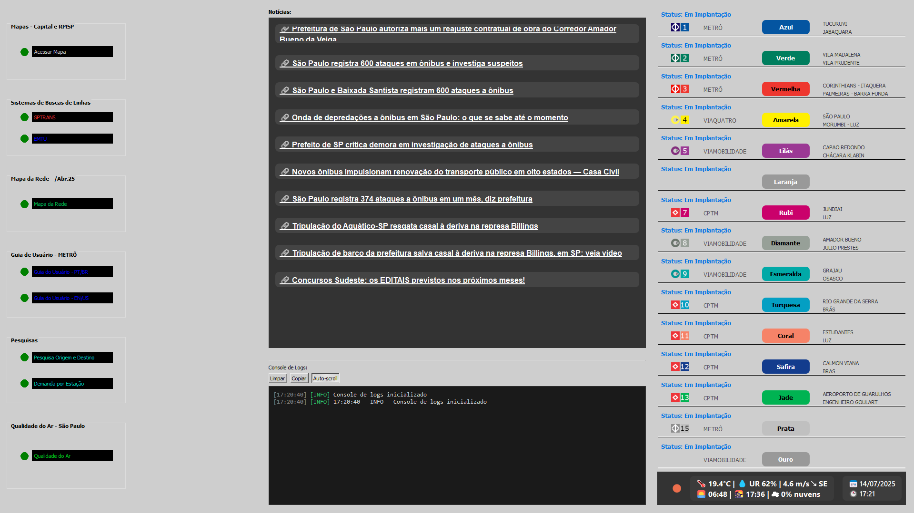
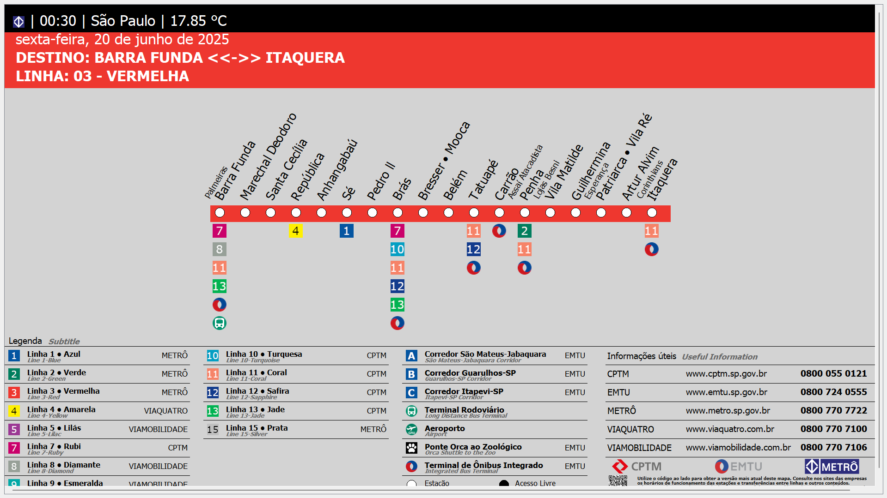
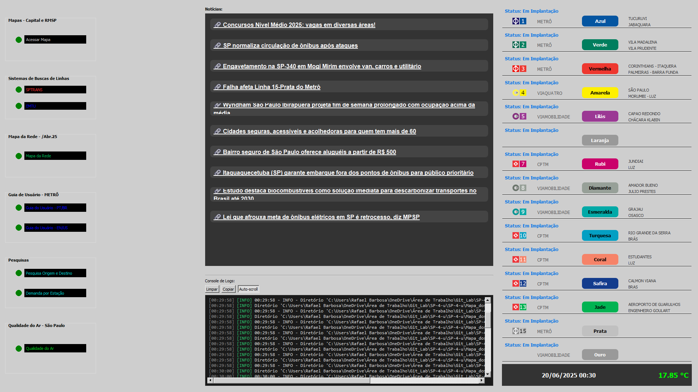

# 🚇 Mapas dos Trilhos/Ônibus/Ciclovias de São Paulo - SP4U

<div align="center">
  
  
  
  
  
</div>

## 🌟 Sobre o Projeto

Bem-vindo ao **Sampa 4U** - seu guia digital completo para o transporte público de São Paulo! Este repositório contém:

🚆 Mapas interativos de metrô, CPTM e concessionárias

📊 Dados da Pesquisa Origem-Destino (1977-2022)

📈 Estatísticas de demanda por estação/linha

🚌 Rotas de ônibus da SPTrans/EMTU

🚲 Informações sobre ciclovias e bicicletários

🌡️ Condições meteorológicas

📰 Notícias relevantes sobre transporte público

Desenvolvido em:  


Consulte a versão web: 

## 🎨 Paleta de Cores do Transporte Sobre Trilhos

| Linha         | Cor                                                             | Hexadecimal |
| ------------- | --------------------------------------------------------------- | ----------- |
| 1 - Azul      |  | `#0455A1`   |
| 2 - Verde     |  | `#007E5E`   |
| 3 - Vermelha  |  | `#EE372F`   |
| 4 - Amarela   |  | `#FFF000`   |
| 5 - Lilás     |  | `#9B3894`   |
| 7 - Rubi      |  | `#CA016B`   |
| 8 - Diamante  |  | `#97A098`   |
| 9 - Esmeralda |  | `#01A9A7`   |
| 10 - Turquesa |  | `#049FC3`   |
| 11 - Coral    |  | `#F68368`   |
| 12 - Safira   |  | `#133C8D`   |
| 13 - Jade     |  | `#00B352`   |
| 15 - Prata    |  | `#C0C0C0`   |

## 📌 Últimas Atualizações

### 🚇 Metrô/CPTM/Concessionárias

- 🆕 **Inclusões**: Nada para mostrar
- ✏️ **Modificações**: Nada para mostrar
- ❌ **Remoções**: Nada para mostrar
- 💰 **Tarifas**: Nada para mostrar

### 🚌 SPTrans

- 💰 **Tarifas**: Nada para mostrar


| Tipo           | Linha                                                       | Rota                                                                                   |
| -------------- | ----------------------------------------------------------- | -------------------------------------------------------------------------------------- |                                                                                       
| ✏️ Modificação |  | **Atual:** Jd. Filhos Da Terra - Metrô Tucuruvi<br>**Antes:** Recanto Verde - Metrô Tucuruvi |     
| ✏️ Modificação |  | **Atual:** Jd. Wilma Flor - Cptm Guaianases<br>**Antes:** Sítio Conceição - Cptm Guaianases | 
| ✏️ Modificação |  | **Atual:** Cohab Pres. Juscelino Kubitscheck - E.t. Itaquera<br>**Antes:** Cohab Juscelino - Cptm Guaianases | 
| ❌ Remoção    |  | Metalúrgicos - Circular | 
| ❌ Remoção    |  | Term. João Dias - Term. Bandeira | 
| 🆕 Inclusão   |  | Jd. Amália - Term. Capelinha |   
| 🆕 Inclusão   |  | Term. Capelinha - Metrô Ana Rosa |   
| ❌ Remoção    |  | Pq. Continental - Metrô Butantã | 
                                                                            

### 🚍 EMTU

- Sem alterações recentes

<details>
<summary>📚 Ver histórico completo </summary>

| Data       | Tipo           | Linha                                                       | Rota                                                                                   |
| ---------- | -------------- | ----------------------------------------------------------- | -------------------------------------------------------------------------------------- |
| 02/02/2025 | ❌ Remoção    |  | Parada Inglesa - Ônibus Do Passeio Iluminado                                                |
| 02/02/2025 | ❌ Remoção    |  | Parada Inglesa - Ônibus Do Passeio Iluminado                                                |
| 02/02/2025 | ❌ Remoção    |  | Parada Inglesa - Ônibus Do Passeio Iluminado                                                |
| 02/02/2025 | ❌ Remoção    |  | Parada Inglesa - Ônibus Do Passeio Iluminado                                                |
| 02/02/2025 | ❌ Remoção    |  | Parada Inglesa - Ônibus Do Passeio Iluminado                                                |
| 02/02/2025 | ❌ Remoção    |  | Parada Inglesa - Ônibus Do Passeio Iluminado                                                |
| 02/02/2025 | ❌ Remoção    |  | Parada Inglesa - Ônibus Do Passeio Iluminado                                                |
| 02/02/2025 | ❌ Remoção    |  | Parada Inglesa - Ônibus Do Passeio Iluminado                                                |
| 02/02/2025 | ❌ Remoção    |  | Parada Inglesa - Ônibus Do Passeio Iluminado                                                |
| 02/02/2025 | ❌ Remoção    |  | Parada Inglesa - Ônibus Do Passeio Iluminado                                                |
| 02/02/2025 | ❌ Remoção    |  | Parada Inglesa - Ônibus Do Passeio Iluminado                                                |
| 02/02/2025 | ❌ Remoção    |  | Parada Inglesa - Ônibus Do Passeio Iluminado                                                |
| 02/02/2025 | ❌ Remoção    |  | Parada Inglesa - Ônibus Do Passeio Iluminado                                                |
| 02/02/2025 | ❌ Remoção    |  | Alvinópolis (metro Vl. Matilde) - Ônibus Do Passeio Iluminado                               |
| 02/02/2025 | ❌ Remoção    |  | Alvinópolis (metro Vl. Matilde) - Ônibus Do Passeio Iluminado                               |
| 02/02/2025 | ❌ Remoção    |  | Alvinópolis (metro Vl. Matilde) - Ônibus Do Passeio Iluminado                               |
| 02/02/2025 | ❌ Remoção    |  | Alvinópolis (metro Vl. Matilde) - Ônibus Do Passeio Iluminado                               |
| 02/02/2025 | ❌ Remoção    |  | Alvinópolis (metro Vl. Matilde) - Ônibus Do Passeio Iluminado                               |
| 02/02/2025 | ❌ Remoção    |  | Alvinópolis (metro Vl. Matilde) - Ônibus Do Passeio Iluminado                               |
| 02/02/2025 | ❌ Remoção    |  | Alvinópolis (metro Vl. Matilde) - Ônibus Do Passeio Iluminado                               |
| 02/02/2025 | ❌ Remoção    |  | Alvinópolis (metro Vl. Matilde) - Ônibus Do Passeio Iluminado                               |
| 02/02/2025 | ❌ Remoção    |  | Alvinópolis (metro Vl. Matilde) - Ônibus Do Passeio Iluminado                               |
| 02/02/2025 | ❌ Remoção    |  | Alvinópolis (metro Vl. Matilde) - Ônibus Do Passeio Iluminado                               |
| 02/02/2025 | ❌ Remoção    |  | Alvinópolis (metro Vl. Matilde) - Ônibus Do Passeio Iluminado                               |
| 02/02/2025 | ❌ Remoção    |  | Alvinópolis (metro Vl. Matilde) - Ônibus Do Passeio Iluminado                               |
| 02/02/2025 | ❌ Remoção    |  | Alvinópolis (metro Vl. Matilde) - Ônibus Do Passeio Iluminado                               |
| 02/02/2025 | ❌ Remoção    |  | Interlagos - Ônibus Do Passeio Iluminado                              |
| 02/02/2025 | ❌ Remoção    |  | Interlagos - Ônibus Do Passeio Iluminado                              |
| 02/02/2025 | ❌ Remoção    |  | Interlagos - Ônibus Do Passeio Iluminado                              |
| 02/02/2025 | ❌ Remoção    |  | Interlagos - Ônibus Do Passeio Iluminado                              |
| 02/02/2025 | ❌ Remoção    |  | Interlagos - Ônibus Do Passeio Iluminado                              |
| 02/02/2025 | ❌ Remoção    |  | Interlagos - Ônibus Do Passeio Iluminado                              |
| 02/02/2025 | ❌ Remoção    |  | Interlagos - Ônibus Do Passeio Iluminado                              |
| 02/02/2025 | ❌ Remoção    |  | Interlagos - Ônibus Do Passeio Iluminado                              |        
| 02/02/2025 | ❌ Remoção     |  | Term. Pq. D. Pedro II - Natal Iluminado                              |
| 01/12/2025 | 🆕 Inclusão    |  | Term. Pq. D. Pedro II - Natal Iluminado                                                 |
| 01/12/2025 | ❌ Remoção     |  | Pça. Silvio Romero - Term. Vl. Prudente                                                   |
| 01/12/2025 | 🆕 Inclusão    |  | Parada Inglesa - Ônibus Do Passeio Iluminado                                                |
| 01/12/2025 | 🆕 Inclusão    |  | Parada Inglesa - Ônibus Do Passeio Iluminado                                                |
| 01/12/2025 | 🆕 Inclusão    |  | Parada Inglesa - Ônibus Do Passeio Iluminado                                                |
| 01/12/2025 | 🆕 Inclusão    |  | Parada Inglesa - Ônibus Do Passeio Iluminado                                                |
| 01/12/2025 | 🆕 Inclusão    |  | Parada Inglesa - Ônibus Do Passeio Iluminado                                                |
| 01/12/2025 | 🆕 Inclusão    |  | Parada Inglesa - Ônibus Do Passeio Iluminado                                                |
| 01/12/2025 | 🆕 Inclusão    |  | Parada Inglesa - Ônibus Do Passeio Iluminado                                                |
| 01/12/2025 | 🆕 Inclusão    |  | Parada Inglesa - Ônibus Do Passeio Iluminado                                                |
| 01/12/2025 | 🆕 Inclusão    |  | Parada Inglesa - Ônibus Do Passeio Iluminado                                                |
| 01/12/2025 | 🆕 Inclusão    |  | Parada Inglesa - Ônibus Do Passeio Iluminado                                                |
| 01/12/2025 | 🆕 Inclusão    |  | Parada Inglesa - Ônibus Do Passeio Iluminado                                                |
| 01/12/2025 | 🆕 Inclusão    |  | Parada Inglesa - Ônibus Do Passeio Iluminado                                                |
| 01/12/2025 | 🆕 Inclusão    |  | Parada Inglesa - Ônibus Do Passeio Iluminado                                                |
| 01/12/2025 | 🆕 Inclusão    |  | Alvinópolis (metro Vl. Matilde) - Ônibus Do Passeio Iluminado                               |
| 01/12/2025 | 🆕 Inclusão    |  | Alvinópolis (metro Vl. Matilde) - Ônibus Do Passeio Iluminado                               |
| 01/12/2025 | 🆕 Inclusão    |  | Alvinópolis (metro Vl. Matilde) - Ônibus Do Passeio Iluminado                               |
| 01/12/2025 | 🆕 Inclusão    |  | Alvinópolis (metro Vl. Matilde) - Ônibus Do Passeio Iluminado                               |
| 01/12/2025 | 🆕 Inclusão    |  | Alvinópolis (metro Vl. Matilde) - Ônibus Do Passeio Iluminado                               |
| 01/12/2025 | 🆕 Inclusão    |  | Alvinópolis (metro Vl. Matilde) - Ônibus Do Passeio Iluminado                               |
| 01/12/2025 | 🆕 Inclusão    |  | Alvinópolis (metro Vl. Matilde) - Ônibus Do Passeio Iluminado                               |
| 01/12/2025 | 🆕 Inclusão    |  | Alvinópolis (metro Vl. Matilde) - Ônibus Do Passeio Iluminado                               |
| 01/12/2025 | 🆕 Inclusão    |  | Alvinópolis (metro Vl. Matilde) - Ônibus Do Passeio Iluminado                               |
| 01/12/2025 | 🆕 Inclusão    |  | Alvinópolis (metro Vl. Matilde) - Ônibus Do Passeio Iluminado                               |
| 01/12/2025 | 🆕 Inclusão    |  | Alvinópolis (metro Vl. Matilde) - Ônibus Do Passeio Iluminado                               |
| 01/12/2025 | 🆕 Inclusão    |  | Alvinópolis (metro Vl. Matilde) - Ônibus Do Passeio Iluminado                               |
| 01/12/2025 | 🆕 Inclusão    |  | Alvinópolis (metro Vl. Matilde) - Ônibus Do Passeio Iluminado                               |
| 01/12/2025 | ✏️ Modificação |  | **Atual:** Pq. São Rafael - Term. São Mateus<br>**Antes:** Term. São Mateus - Jd. Rodolfo Pirani |
| 01/12/2025 | ✏️ Modificação |  | **Atual:** Pq. São Rafael - Term. São Mateus<br>**Antes:** Term. São Mateus - Jd. Rodolfo Pirani |
| 01/12/2025 | 🆕 Inclusão    |  | Vl. Liviero - Metrô São Judas                                                |
| 01/12/2025 | 🆕 Inclusão    |  | Interlagos - Ônibus Do Passeio Iluminado                              |
| 01/12/2025 | 🆕 Inclusão    |  | Interlagos - Ônibus Do Passeio Iluminado                              |
| 01/12/2025 | 🆕 Inclusão    |  | Interlagos - Ônibus Do Passeio Iluminado                              |
| 01/12/2025 | 🆕 Inclusão    |  | Interlagos - Ônibus Do Passeio Iluminado                              |
| 01/12/2025 | 🆕 Inclusão    |  | Interlagos - Ônibus Do Passeio Iluminado                              |
| 01/12/2025 | 🆕 Inclusão    |  | Interlagos - Ônibus Do Passeio Iluminado                              |
| 01/12/2025 | 🆕 Inclusão    |  | Interlagos - Ônibus Do Passeio Iluminado                              |
| 01/12/2025 | 🆕 Inclusão    |  | Interlagos - Ônibus Do Passeio Iluminado                              |
| 01/12/2025 | 🆕 Inclusão    |  | Term. Parelheiros - Est. Varginha                                                 |
| 01/12/2025 | ❌ Remoção     |  | Cid. Pirituba - Pça. Ramos De Azevedo                                                   |
| 01/12/2025 | ❌ Remoção     |  | Cohab Pedra Verde - Pça. Ramos De Azevedo   
| 23/10/2025 | ✏️ Modificação |  | **Atual:** Term. Vl. Prudente - Vl. Matias<br>**Antes:** Ipiranga - Vl Matias |
| 04/10/2025 | 🆕 Inclusão    |  | Vl. Liviero - Metrô Santos Imigrantes                                                  |
| 04/10/2025 | 🆕 Inclusão    |  | Term. Pq. D. Pedro Ii - Pinacoteca                                                     |    
| 04/10/2025 | 🆕 Inclusão    |  | Museu Ipiranga  - Pq. Ibirapuera                                                       |   
| 04/10/2025 | 🆕 Inclusão    |  | Paraíso - Pacaembu                                                                     |
| 02/09/2025 | ✏️ Modificação |  | **Atual:** Metrô Tamanduateí - Metrô Sta. Cruz<br>**Antes:** Sacomã - Metrô Sta. Cruz |
| 06/08/2025 | ✏️ Modificação |  | **Atual:** Est. Autódromo - Vl. Sta. Catarina<br>**Antes:** Est. Autódromo - Vl. Joaniza |
| 06/08/2025 | ✏️ Modificação |  | **Atual:** Est. Autódromo - Vl. Sta. Catarina<br>**Antes:** Est. Autódromo - Vl. Joaniza |
| 06/08/2025 | ❌ Remoção     |  | Term. Varginha - E.t. Vitor Manzini                                                    |
| 06/08/2025 | ❌ Remoção     |  | Metrô Barra Funda - São João / Ctn                                                     |
| 23/06/2025 | 🆕 Inclusão    |  | Metrô Barra Funda - São João / Ctn                                                     |
| 23/06/2025 | ✏️ Modificação |  | **Atual:** Cachoeirinha - Jd. Sta. Cruz<br>**Antes:** Term. Cachoeirinha - Jd. Sta. Cruz |
| 23/06/2025 | ❌ Remoção     |  | Morro Doce - Term. Jd. Britania                                                        |
| 20/06/2025 | 🆕 Inclusão    |  | Metrô Tietê → Centro Tea                                                              |
| 20/06/2025 | 🆕 Inclusão    |  | Guaianases → São Mateus                                                               |
| 20/06/2025 | ✏️ Modificação |  | **Atual:** Pq. Boa Esperança → Term. São Mateus<br>**Antes:** (Cor anterior: Amarelo) |
| 20/06/2025 | ❌ Remoção     |  | Guaianases → São Mateus                                                               |

</details>

## 🛠️ Tecnologias Utilizadas

<details>
<summary>📚 Bibliotecas Python Necessárias</summary>

```bash
# Pacotes básicos e utilitários
pip install requests
pip install beautifulsoup4
pip install pillow
pip install colorama
pip install pytz
pip install pandas
pip install numpy
pip install python-dotenv
pip install certifi
pip install screeninfo
pip install pyproj
pip install logging
pip install atexit
pip install python-dateutil
pip install tzlocal

# Interface gráfica
pip install PyQt5
pip install pyqtwebengine
pip install tk
pip install customtkinter

# Mapeamento e geolocalização
pip install folium
pip install geopandas
pip install shapely
pip install fiona
pip install geopy

# Manipulação de documentos
pip install pymupdf
pip install fitz
pip install reportlab

# Web scraping e notícias
pip install googlenews
pip install selenium

# Visualização de dados
pip install matplotlib
pip install seaborn
pip install mplcursors

# Outros utilitários
pip install webbrowser
pip install datetime
pip install threading
pip install re
pip install json
pip install csv
pip install locale
pip install difflib
pip install tempfile
pip install subprocess
pip install typing
```

</details>

### 🖥️ IDEs Recomendadas


## 📊 Fontes de Dados

- � [Citylines](https://www.citylines.co/data?city=sao-paulo) - Dados de traçados
- 🚌 [SPTrans](https://www.sptrans.com.br/desenvolvedores/) - API de ônibus
- 🚆 [METRÔ SP](https://www.metro.sp.gov.br/) - Mapas e guias
- 🚉 [CPTM](https://www.cptm.sp.gov.br/) - Informações ferroviárias
- 🌫️ [World's Air Pollution](https://waqi.info/) - Qualidade do ar
- 📰 [News API](https://newsapi.org/) - Notícias em tempo real
- 🌡 [OpenWeatehrMap](https://openweathermap.org/) - API de clima

## 🚀 Como Executar

```bash
# Windows
python main.py

# Linux/Mac
python3 main.py
```

## 📸 Screenshots

<div align="center"> <h3>Versão Desktop (Python)</h3> 
 
 
 
 
 
<h3>Versões Anteriores</h3>  
 
 
 


## 📈 Diagrama da Arquitetura (v1.1.0)


## 📌 Roadmap de Desenvolvimento

🔧 Refatoração e Estrutura  
- [ ] 🧠🗺️ Ajustar Diagrama 🚧`>>> EM DESENVOLVIMENTO`🚧  
- [ ] 🧠🗺️ Criar microdiagramas sobre algumas funções vitais do programa  

📚 Documentação (readme)  
- Sem modificações futuras.  

🌐 Funcionalidades Web  
- Sem modificações futuras.  

🛠️ Logs e Validações  
- Sem modificações futuras.  

🖼️ Interface  

- [ ] 🚲 Atualização de Mapa Ciclovia

<details>
<summary>📚 Ver histórico completo</summary>

- [x] 🚇 Atualização de nome estação com naming right: Berrini - Casas Bahia (Linha 9 - Esmeralda) `Concluído em 02/01/2026`  
- [x] 🚇 Atualização de nome estação com naming right: Adolfo Pinheiro - Unisa (Linha 5 - Lilás) `Concluído em 02/01/2026`  
- [x] 🚇 Atualização de nome estação com naming right: Vergueiro - Sebrae (Linha 1 - Azul) `Concluído em 02/01/2026`  
- [x] 🚇 Atualização de inclusão do Expresso Aeroporto em conjunto com a Linha 13 - Jade `Concluído em 24/10/2025`  
- [x] 🚇 Atualização das estações e linhas que iniciam e terminam em BFU (Palmeiras - Barra Funda) `Concluído em 02/09/2025`  
- [x] 🗺️ Atualização do Mapa do Metropolitano (Ago./25) `Concluído em 02/09/2025`  
- [x] 🧼 Comentar e aprimorar os códigos com docstrings `Concluído em 23/07/2025`  
- [x] 🌍 Voltar a ler status das linhas via web scraping `Concluído em 16/07/2025`  
- [x] 🌡️ Inserir mais dados e itens relacionados à temperatura `Concluído em 14/07/2025`  
- [x] ✍️ Ajustar estrutura e seções dos .md `Concluído em 08/07/2025`  
- [x] 🪵 Validar os logs (necessários) `Concluído em 08/07/2025`  
- [x] 🎨 Criar interface visual com Qt Designer `Concluído em 03/07/2025`  
- [x] ✅ Confirmação para encerrar o programa principal `Concluído em 30/06/2025`  
- [x] 🏷️ Adicionar cabeçalhos nos arquivos Python para facilitar manutenção `Concluído em 28/06/2025`  
- [x] 📝 Atualização bibliotecas no `README.md` `Concluído em 20/06/2025`  

</details>

## 📜 Licença

Distribuído sob a Licença MIT.

📘 Nota: Este projeto foi desenvolvido com fins educacionais e não possui vínculo oficial com órgãos públicos.

⚠️ Aviso: Este projeto é mantido por uma única pessoa. O desenvolvimento principal ocorre diretamente na branch main, mas Pull Requests são sempre bem-vindos!

---

<div align="center"> 🌆 <i>Sua jornada por São Paulo começa aqui!</i> 🌆 </div>
